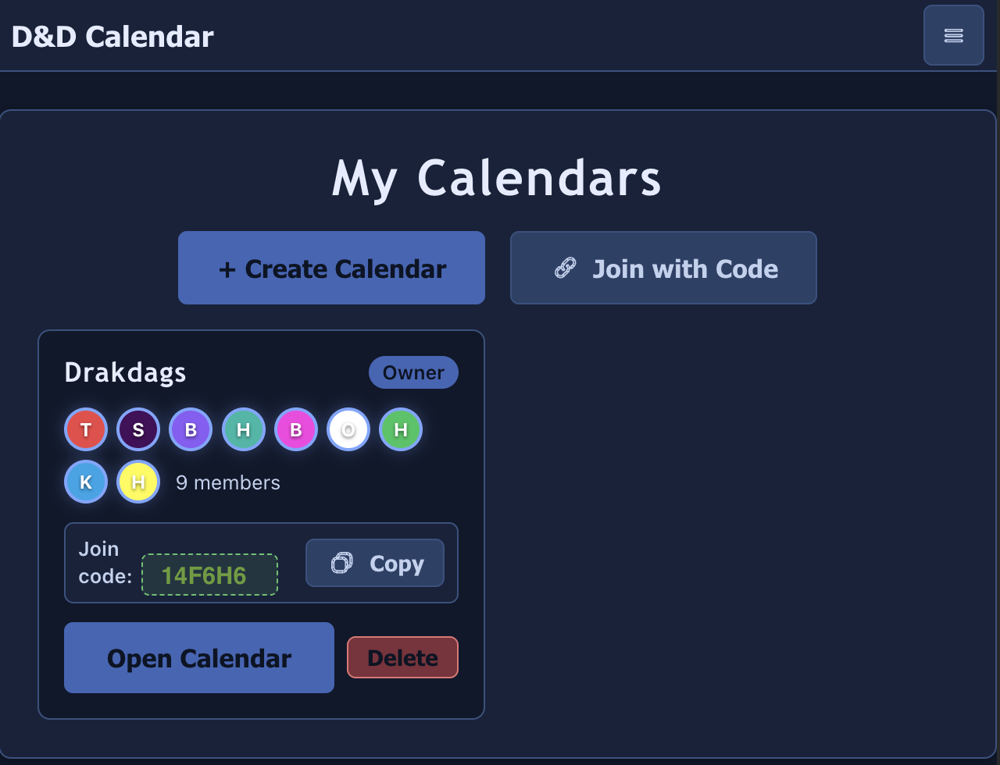
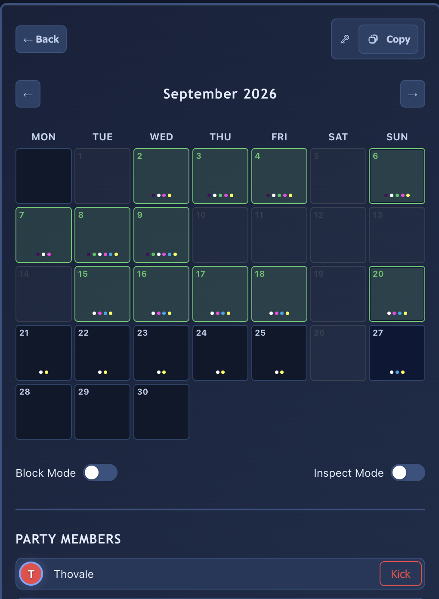
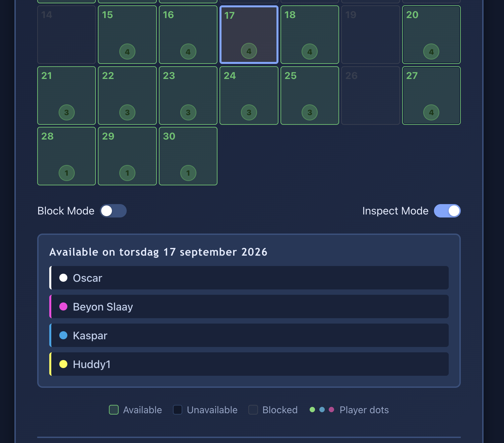
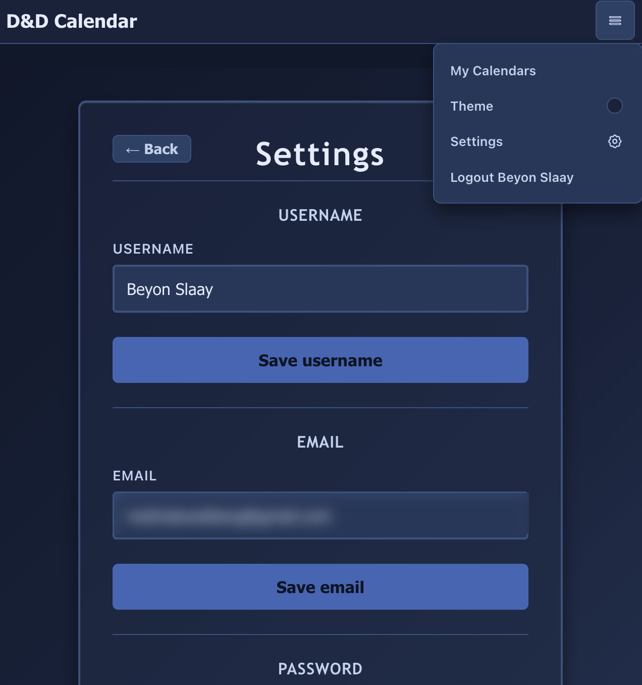

# D&D Calendar

A shared availability calendar for tabletop groups. Players mark which dates they're free, the GM sees who's available at a glance, and the app highlights Swedish public holidays so nobody schedules a session on Midsummer's Eve.

Built as a React SPA backed by a Cloudflare Worker API and a Cloudflare D1 (SQLite) database.

**Live demo:** [dndcalendar.pages.dev](https://dndcalendar.pages.dev/). Create your own account and invite others! Or test the demo account with username `demo` and password `demo123`.

## Screenshots

| My Calendars | Calendar view |
|---|---|
|  |  |

| Member management | Settings |
|---|---|
|  |  |

## Features

- **Accounts & auth** — email/password registration and login, JWT-based sessions, and a settings page for updating username, email, and password.
- **Calendars** — create a calendar, invite others with a shareable join code, and belong to multiple calendars at once.
- **Availability** — each member toggles which days they're free for a given month; the calendar view shows everyone's availability color-coded per member.
- **Admin controls** — the calendar owner can disable dates (e.g. holidays, venue unavailable), kick members, and view an availability summary across the group.
- **Swedish holidays** — the calendar view fetches and highlights Swedish public holidays via the [Dagsmart API](https://dagsmart.se/api/).
- **Light/dark theme** toggle.

## Tech stack

| Layer | Stack |
|---|---|
| Client | React 18, React Router, TypeScript, Vite, Axios |
| API | Cloudflare Workers, TypeScript |
| Database | Cloudflare D1 |
| Auth | JWT ([jose](https://github.com/panva/jose)), bcrypt password hashing |
| Hosting | Cloudflare Pages (client) + Cloudflare Workers (API) |

## Project structure

```
client/   React SPA (Vite)
worker/   Cloudflare Worker API (Hono-less, hand-rolled router)
```

Worker routes live under `worker/src/routes/` (`auth`, `calendars`, `availability`, `admin`) and are wired up in [`worker/src/router.ts`](worker/src/router.ts).

## Getting started

### Prerequisites

- Node.js 20+
- A [Cloudflare account](https://dash.cloudflare.com/) with Wrangler (`npm i -g wrangler` or use the local devDependency) and a D1 database created for the worker

### Setup

```bash
npm install
cd client && npm install && cd ..
cd worker && npm install && cd ..
```

Create a `client/.env.local` (or `.env.production` for builds) pointing at your API:

```
VITE_API_URL=http://localhost:8787
```

Configure `worker/wrangler.toml` with your own D1 `database_id` and set the `JWT_SECRET` secret:

```bash
cd worker
wrangler secret put JWT_SECRET
```

### Run locally

From the repo root:

```bash
npm run worker:dev   # starts the API on http://localhost:8787
npm run client       # starts the Vite dev server
```

### Build & deploy

```bash
npm run build          # builds the client
npm run worker:deploy  # deploys the worker to Cloudflare
```

Pushes to `main` also trigger [`.github/workflows/deploy.yml`](.github/workflows/deploy.yml), which builds the client and deploys both the Worker and the Cloudflare Pages site. It expects these repository secrets: `CLOUDFLARE_API_TOKEN`, `CLOUDFLARE_ACCOUNT_ID`, `REACT_APP_API_URL`.

## API overview

All endpoints are prefixed with `/api`.

| Area | Endpoints |
|---|---|
| Auth | `POST /auth/register`, `POST /auth/login`, `GET /auth/me`, `PATCH /auth/me/{username,email,password}` |
| Calendars | `POST /calendars/create`, `POST /calendars/join`, `GET /calendars/mine`, `GET \| DELETE /calendars/:id`, `POST /calendars/:id/leave`, `POST /calendars/:id/kick`, `PATCH /calendars/:id/color` |
| Availability | `POST /availability/:calendarId/toggle`, `GET /availability/:calendarId/month/:year/:month` |
| Admin | `POST /admin/:calendarId/disable-date`, `POST /admin/:calendarId/enable-date`, `GET /admin/:calendarId/disabled-dates`, `GET /admin/:calendarId/availability-summary/:year/:month` |

## License

No license specified — all rights reserved by default.
